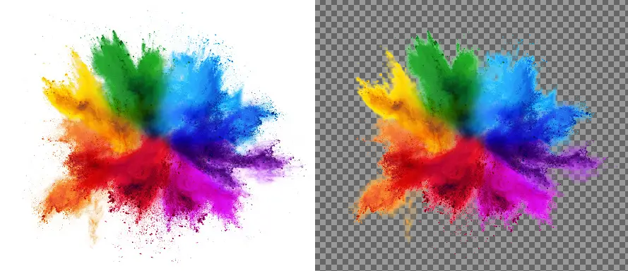

# GIMP Color-to-Alpha

This project is an interactive recreation of GIMP's color-to-alpha algorithm using Streamlit. Color to alpha is widely used for background removal and is one of GIMP's most useful photo manipulation functions.

## How it Works

The algorithm measures the distance between colors in RGB space and determines if they should be transparent, opaque, or partially transparent based on their location relative to user-specified thresholds. This version of Color to Alpha adds a spherical (Euclidean) distance metric as an alternate way to determine distance between two colors. In addition, the user may also now change the interpolation of the alpha value which may help acheive more gradual or sharp feathering of edges if necessary.

## Use and Learn

Feel free to use the web app on [Streamlit](https://color-to-alpha.streamlit.app/) and read more about the algorithm on [Medium](https://medium.com/@mcreynolds02/how-gimps-color-to-alpha-tool-works-82372367afcd)
